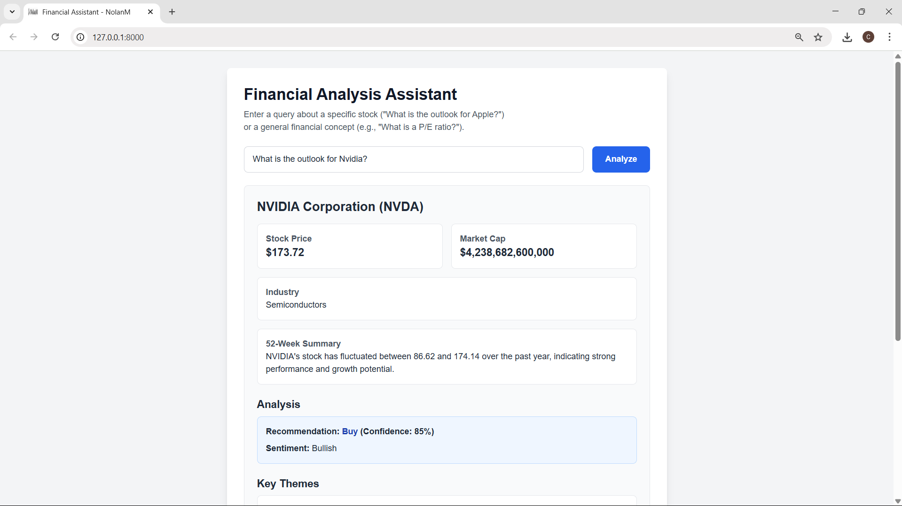
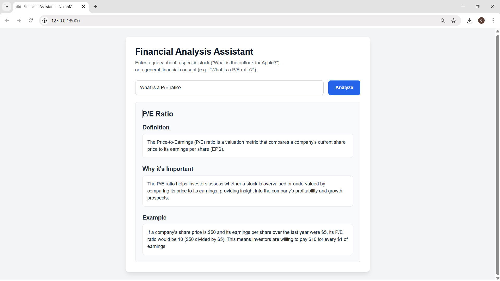
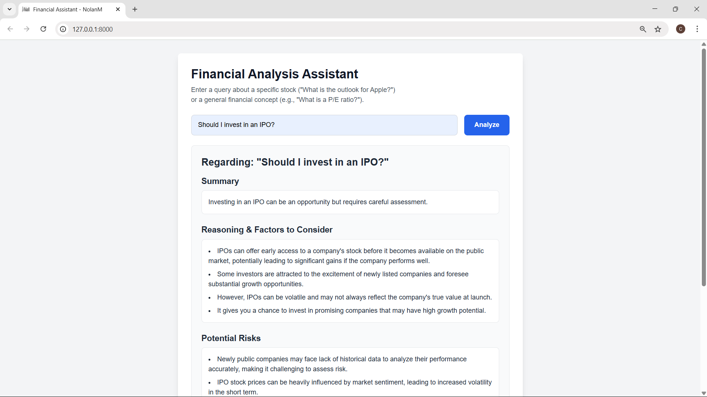

<div style="align:center"><h1>Finance RAG Pipeline</h1></div>

This is the model will take the input is the query related to the financial field specificly for stock to answer about the based knowledge question or analysis the specific stocks using 1 year historical data prices with 1 year news related to the stock symbol

---

<div style="text-align: center; font-family: sans-serif;">
    <h2>I. Sample Output</h2>
    <table style="width: 100%; border-collapse: collapse; margin: 0 auto; table-layout: fixed;">
        <tbody>
            <tr>
                <td style="width: 33.33%; vertical-align: top; padding: 0 15px; font-size: 14px;">
                    <h5>A. Ticker Analysis Services</h5>
                    <p><b>Input Query:</b> What is the current price of Nvidia?</p>
                    
                </td>
                <td style="width: 33.33%; vertical-align: top; padding: 0 15px; font-size: 14px;">
                    <h5>B. General Knowledge Services</h5>
                    <p><b>Input Query:</b> What is a P/E ratio?</p>
                    
                </td>
                <td style="width: 33.33%; vertical-align: top; padding: 0 15px; font-size: 14px;">
                    <h5>C. Financial Advice Services</h5>
                    <p><b>Input Query:</b> Should I invest in an IPO?</p>
                    
                </td>
            </tr>
        </tbody>
    </table>
</div>

---
<div style="text-align: center; font-family: sans-serif;">
    <h2>II. Prerequisites</h2>
</div>

### A. Install the Requirements Dependencies
<details>
  <summary><b>Method 1: Install using pip (Manual)</b></summary>
  <br>
  <ul>
    <li>Make sure you have Python installed on your system.</li>
    <li>Open a terminal or command prompt.</li>
    <li>Navigate to the project directory where the <code>requirements.txt</code> file is located.</li>
    <li>Run the following command to install the required packages:</li>
  </ul>

<pre style="margin-left: 2em;"><code>pip install -r requirements.txt</code></pre>
</details>

<details>
  <summary><b>Method 2: Install using Script (Automatically)</b></summary>
  <ul>
    <li>Double-click the <code>Install.bat</code> file to automatically install the required packages (Windows only).</li>
  </ul>
</details>

### B. Update the API Keys inside the assistant/.env file
- Open the `.env` file located in the `root` directory.
- Replace the placeholder values with your actual API keys for OpenAI, Finnhub, and Financial Modeling Prep.

- Save the changes to the `.env` file.

    ```plaintext
    OPENAI_API_KEY=your_openai_api_key
    FINNHUB_API_KEY=your_finnhub_api_key
    FMP_API_KEY=your_financial_modeling_prep_api_key
    ```

    

### C. Run the Script

<details>
    <summary><b>Method 1: Run the code in terminal (Manual)</b></summary>
    <br>
    <ul>
        <li><b>Step 1: Update the sqlite Database</b></li>
    </ul>
    <pre style="margin-left: 2em;"><code>python manage.py migrate</code></pre>
    <ul>
        <li><b>Step 2: Run the Django Server</b></li>
    </ul>
    <pre style="margin-left: 2em;"><code>python manage.py runserver</code></pre>
</details>

<details>
    <summary><b>Method 2: Run the code using Script (Automatically)</b></summary>
    <br>
    <ul>
        <li>Double-click the <code>Analysis_Server.bat</code> file to automatically run the server (Windows only).</li>
    </ul>
</details>

### D. Deploying with Ngrok (Server Running Locally - Optional)

- **Step 1: Install and Configure ngrok**
   - Go to the ngrok website to sign up and download the client ([ngrok](https://ngrok.com/download))
   - Find your authtoken on the ngrok dashboard.
   - Connect your account using the command below.
     ```
     ngrok config add-authtoken YOUR_AUTHTOKEN
     ```


- **Step 2: Run Django Server and ngrok**
   - **Terminal 1: Start Django**
     ```
     python manage.py runserver
     ```
   - **Terminal 2: Start ngrok**
     ```
     ngrok http 8000
     ```

- **Step 3: Access Your Public URL**
   - Ngrok will provide a public URL that forwards to your local server. Look for the "Forwarding" line in the ngrok terminal.
     ```
     Forwarding https://random-string.ngrok-free.app -> http://localhost:8000
     ```

---

